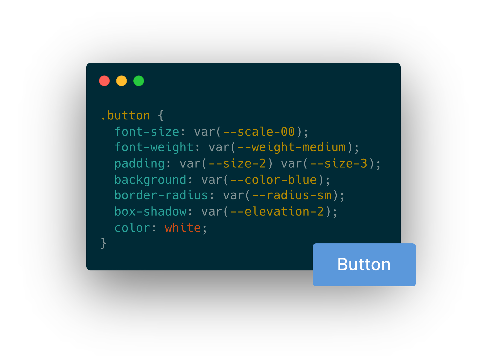

# Introducing Pollen


Pollen is a highly configurable, responsive library of style-agnostic CSS variables for your next design system. It lets you write faster, more consistent, and more maintainable styles.&#x20;

Made and maintained with ❤️ by the fine people at [Bokeh](https://heybokeh.com).

### Features

* Robust library of well-considered, style-agnostic CSS variables (see [Broken link](broken-reference "mention"))
* Fully configurable and extensible with CLI build tool (see [configuration](basics/configuration/ "mention"))
* Zero setup required to get started (see [getting-started.md](basics/getting-started.md "mention"))
* Easy responsive design with support for configuring CSS queries (see [queries.md](basics/configuration/queries.md "mention"))
* Lightweight, human-readable output if you ever want to move away from Pollen

### What it looks like

Pollen's design tokens can be used to build any project. They're easy to completely customise and extend and they don't require preprocessors, class naming conventions, or non-standard syntax. Generate an entirely custom design system with a simple [config file](basics/configuration/).





```css
.button {
   font-family: var(--font-sans);
   font-size: var(--scale-00);
   font-weight: var(--weight-medium); 
   line-height: var(--line-none);
   padding: var(--size-3) var(--size-5);
   background: var(--color-blue);
   border-radius: var(--radius-xs);
   color: white;
}
```



```jsx
const Button = styled.button`
   font-family: var(--font-sans);
   font-size: var(--scale-00);
   font-weight: var(--weight-medium); 
   line-height: var(--line-none);
   padding: var(--size-3) var(--size-5);
   background: var(--color-blue);
   border-radius: var(--radius-xs);
   color: white;
`
```



```jsx
<button styles={{ 
   fontFamily: 'var(--font-sans)',
   fontSize: 'var(--scale-00)',
   fontWeight: 'var(--weight-medium)',
   lineHeight: 'var(--line-none)',
   padding: 'var(--size-3) var(--size-5)',
   background: 'var(--color-blue)',
   borderRadius: 'var(--radius-xs)'
   color: 'white'
}}>
  Button
</button>
  
```



```markup
<button style="font-family: var(--font-sans); font-size: var(--scale-00); font-weight: var(--weight-medium);  line-height: var(--line-none); padding: var(--size-3) var(--size-5); background: var(--color-blue); border-radius: var(--radius-xs); color: white;">
  Button
</button>
```








