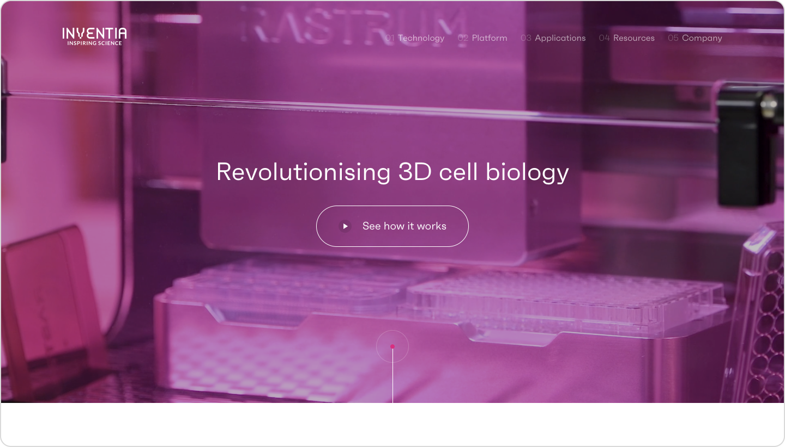
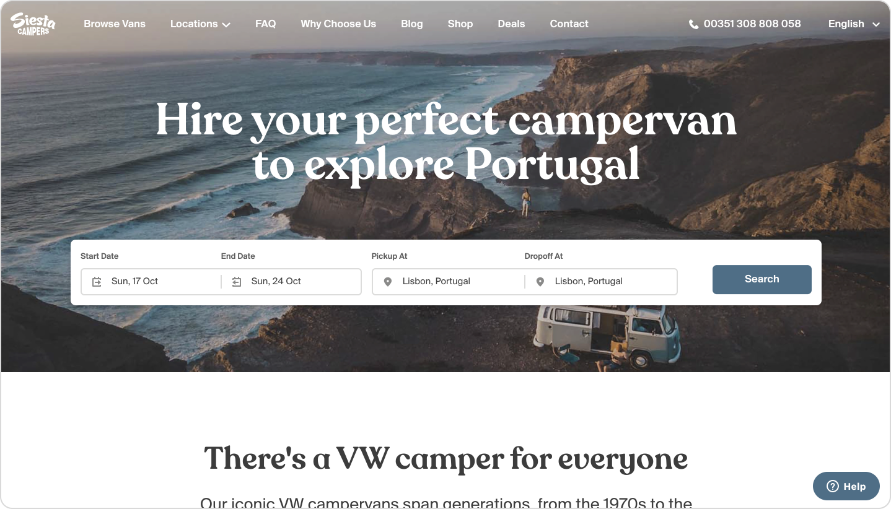
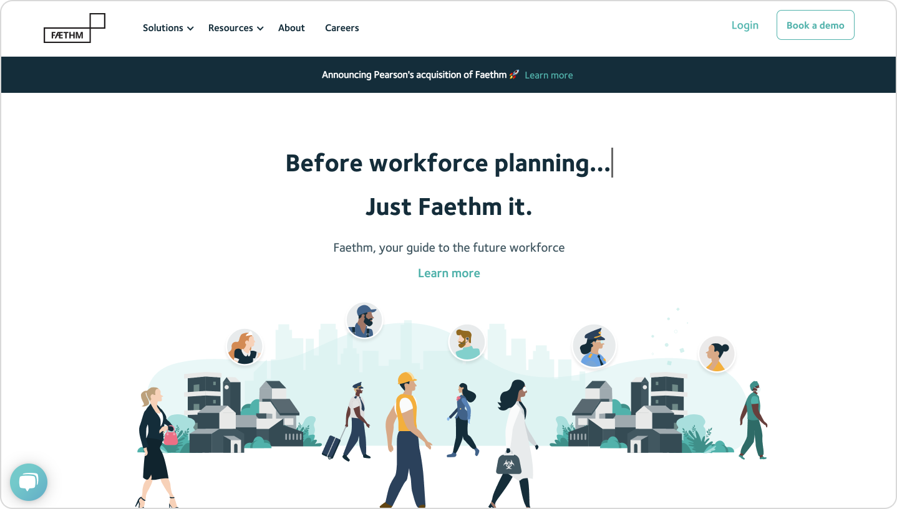
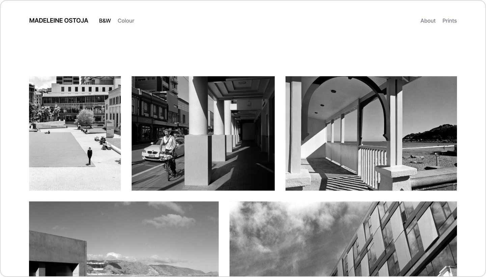

# Introducing Pollen

Pollen is a standards-driven, utility-first CSS library inspired by [Tailwind](https://tailwindcss.com). It provides a collection of [CSS variables](https://developer.mozilla.org/en-US/docs/Web/CSS/--\*) that can be used anywhere to encourage consistency, maintainability, and rapid development.

### What it looks like

Pollen's low-level variables can be used to build any design. They don't require a buildstep or class naming conventions. They're easy to extend and globally responsive, without introducing preprocessors or new syntax.



```css
.button {
   font-family: var(--font-sans);
   font-size: var(--scale-00);
   font-weight: var(--font-medium); 
   line-height: var(--line-none);
   padding: var(--size-3) var(--size-5);
   background: var(--color-blue);
   border-radius: var(--radius-xs);
   color: white;
}
```



```jsx
const Button = styled.button`
   font-family: var(--font-sans);
   font-size: var(--scale-00);
   font-weight: var(--font-medium); 
   line-height: var(--line-none);
   padding: var(--size-3) var(--size-5);
   background: var(--color-blue);
   border-radius: var(--radius-xs);
   color: white;
`
```



```markup
<button style="font-family: var(--font-sans); font-size: var(--scale-00); font-weight: var(--font-medium);  line-height: var(--line-none); padding: var(--size-3) var(--size-5); background: var(--color-blue); border-radius: var(--radius-xs); color: white;">
  Button
</button>
```



```jsx
<button styles={{ 
   fontFamily: 'var(--font-sans)',
   fontSize: 'var(--scale-00)',
   fontWeight: 'var(--font-medium)',
   lineHeight: 'var(--line-none)',
   padding: 'var(--size-3) var(--size-5)',
   background: 'var(--color-blue)',
   borderRadius: 'var(--radius-xs)'
   color: 'white'
}}>
  Button
</button>
  
```





## Who's using Pollen

Pollen is used in production by awesome brands and individuals in projects from small to large-scale. Are you using Pollen? [Open an issue on Github](https://github.com/peppercornstudio/pollen/issues/new) to add your site to the list.


 

 
