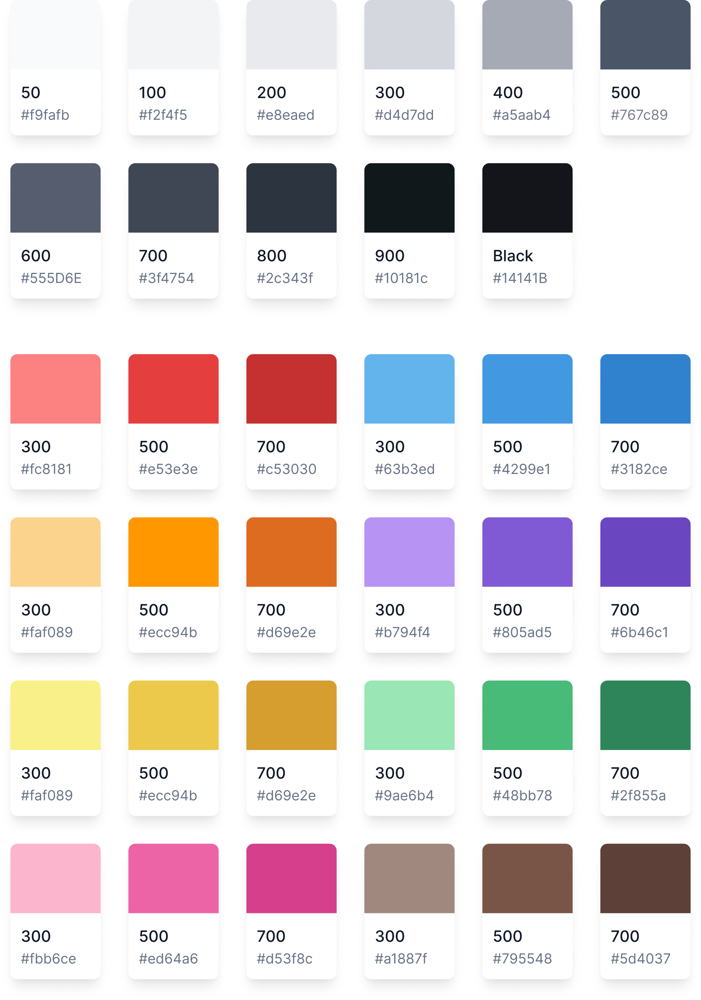

# Colors



Pollen comes with an optional colour palette to encourage consistency across a project. It's designed for rapid prototyping as a better alternative to browser defaults, and to be extended as your project evolves. Add it to your project by enabling the `color` addon in your `pollen.config.js`. Read more about creating a custom Pollen bundle in [configuration](../basics/configuration/ "mention")


```javascript
module.exports = {
  modules: {
    color: true
  }
}
```


## The Palette

| Property group | Applies to                   |
| -------------- | ---------------------------- |
| `--color-*`    | `color` , `background-color` |

Each color has a family of shades ranging from `300` (light) to `700` (dark), as well as an extended greyscale. The unsuffixed color (eg: `--color-red`) in each family is an alias for median in that family (eg: `--color-red-500`).

```css
.alert {
  color: var(--color-red);
}
```

### Greyscale

| Property           | Value                   |
| ------------------ | ----------------------- |
| `--color-grey`     | `var(--color-grey-500)` |
| `--color-grey-50`  | `#f9fafb`               |
| `--color-grey-100` | `#f2f4f5`               |
| `--color-grey-200` | `#e8eaed`               |
| `--color-grey-300` | `#d4d7dd`               |
| `--color-grey-400` | `#a5aab4`               |
| `--color-grey-500` | `#767c89`               |
| `--color-grey-600` | `#555d6e`               |
| `--color-grey-700` | `#3f4754`               |
| `--color-grey-800` | `#2c343f`               |
| `--color-grey-900` | `#10181C`               |
| `--color-black`    | `#14141B`               |

### Red

| Property          | Value                  |
| ----------------- | ---------------------- |
| `--color-red`     | `var(--color-red-500)` |
| `--color-red-300` | `#fc8181`              |
| `--color-red-500` | `#e53e3e`              |
| `--color-red-700` | `#c53030`              |

### Green

| Variable            | Value                    |
| ------------------- | ------------------------ |
| `--color-green`     | `var(--color-green-500)` |
| `--color-green-300` | `#9ae6b4`                |
| `--color-green-500` | `#48bb78`                |
| `--color-green-700` | `#2f855a`                |

### Blue

| Variable           | Value                   |
| ------------------ | ----------------------- |
| `--color-blue`     | `var(--color-blue-500)` |
| `--color-blue-300` | `#63b3ed`               |
| `--color-blue-500` | `#4299e1`               |
| `--color-blue-700` | `#3182ce`               |

### Pink

| Property           | Value                   |
| ------------------ | ----------------------- |
| `--color-pink`     | `var(--color-pink-500)` |
| `--color-pink-300` | `#fbb6ce`               |
| `--color-pink-500` | `#ed64a6`               |
| `--color-pink-700` | `#d53f8c`               |

### Purple

| Property             | Value                     |
| -------------------- | ------------------------- |
| `--color-purple`     | `var(--color-purple-500)` |
| `--color-purple-300` | `#b794f4`                 |
| `--color-purple-500` | `#805ad5`                 |
| `--color-purple-700` | `#6b46c1`                 |

### Teal

| Property           | Value                   |
| ------------------ | ----------------------- |
| `--color-teal`     | `var(--color-teal-500)` |
| `--color-teal-300` | `#81e6d9`               |
| `--color-teal-500` | `#38b2ac`               |
| `--color-teal-700` | `#2c7a7b`               |

### Yellow

| Property             | Value                     |
| -------------------- | ------------------------- |
| `--color-yellow`     | `var(--color-yellow-500)` |
| `--color-yellow-300` | `#faf089`                 |
| `--color-yellow-500` | `#ecc94b`                 |
| `--color-yellow-700` | `#d69e2e`                 |

### Orange

| Property             | Value                     |
| -------------------- | ------------------------- |
| `--color-orange`     | `var(--color-orange-500)` |
| `--color-orange-300` | `#fbd38d`                 |
| `--color-orange-500` | `#ff9800`                 |
| `--color-orange-700` | `#dd6b20`                 |

### Brown

| Property            | Value                    |
| ------------------- | ------------------------ |
| `--color-brown`     | `var(--color-brown-500)` |
| `--color-brown-300` | `#a1887f`                |
| `--color-brown-500` | `#795548`                |
| `--color-brown-700` | `#5d4037`                |
