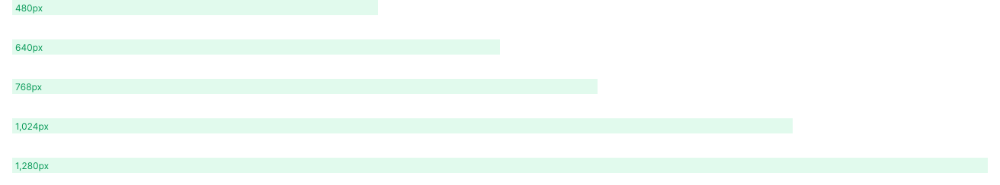

# Layout

## Size Scale

Encourage consistent spacing throughout an interface. Pollen's size scale is proportional, so `--size-16` is twice as much as `--size-8` for example. One size unit is equal to `4px`.

| Property group | Applies to                                                             |
| -------------- | ---------------------------------------------------------------------- |
| `--size-*`     | Any size-related property (`margin`, `padding`, `width`,`height`, etc) |

.svg>)

```css
section {
  margin-top: var(--size-5);
}
```

| Property        | Value         |
| --------------- | ------------- |
| `--size-px`     | `1px`         |
| `--size-1`      | `4px`         |
| `--size-2`      | `8px`         |
| `--size-3`      | `12px`        |
| `--size-4`      | `16px`        |
| `--size-5`      | `20px`        |
| `--size-6`      | `24px`        |
| `--size-7`      | `28px`        |
| `--size-8`      | `32px`        |
| `--size-9`      | `36px`        |
| `--size-10`     | `40px`        |
| `--size-11`     | `44px`        |
| `--size-12`     | `48px`        |
| `--size-14`     | `56px`        |
| `--size-16`     | `64px`        |
| `--size-20`     | `80px`        |
| `--size-24`     | `96px`        |
| `--size-28`     | `112px`       |
| `--size-32`     | `128px`       |
| `--size-36`     | `144px`       |
| `--size-40`     | `160px`       |
| `--size-44`     | `176px`       |
| `--size-48`     | `192px`       |
| `--size-52`     | `208px`       |
| `--size-56`     | `224px`       |
| `--size-60`     | `240px`       |
| `--size-64`     | `256px`       |
| `--size-72`     | `288px`       |
| `--size-80`     | `320px`       |
| `--size-96`     | `384px`       |
| `--size-full`   | `100%`        |
| `--size-screen` | `100vw`       |
| `--size-min`    | `min-content` |
| `--size-max`    | `max-content` |

## Container Widths

Encourage consistent max-widths for containers throughout an interface, based roughly on common device breakpoints

| Property group | Applies to  |
| -------------- | ----------- |
| `--width-*`    | `max-width` |



```css
.page-container {
  max-width: var(--width-md);
  margin: 0 auto;
}
```

| Property     | Value    |
| ------------ | -------- |
| `--width-xs` | `480px`  |
| `--width-sm` | `640px`  |
| `--width-md` | `768px`  |
| `--width-lg` | `1024px` |
| `--width-xl` | `1280px` |

## Aspect Ratios

Simple aspect ratios for common formats

| Property group | Applies to     |
| -------------- | -------------- |
| `--ratio-*`    | `aspect-ratio` |

```css
.image {
  aspect-ratio: var(--ratio-portrait);
}
```

| Property             | Value     |
| -------------------- | --------- |
| `--ratio-square`     | `1/1`     |
| `--ratio-portrait`   | `3/4`     |
| `--ratio-landscape`  | `4/3`     |
| `--ratio-tall`       | `2/3`     |
| `--ratio-wide`       | `3/2`     |
| `--ratio-widescreen` | `16/9`    |
| `--ratio-golden`     | `1.618/1` |
