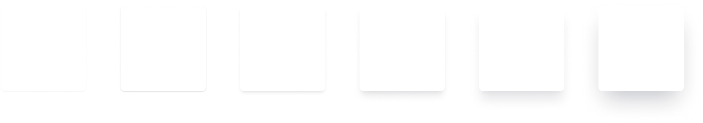

# UI

## Radius

Consistent edge radiuses throughout an interface.

| Property group | Applies to      |
| -------------- | --------------- |
| `--radius-*`   | `border-radius` |


```css
.button {
  border-radius: var(--radius);
}
```

| Property        | Value    |
| --------------- | -------- |
| `--radius-xs`   | `3px`    |
| `--radius-sm`   | `6px`    |
| `--radius-md`   | `8px`    |
| `--radius-lg`   | `12px`   |
| `--radius-xl`   | `16px`   |
| `--radius-100`  | `100%`   |
| `--radius-full` | `9999px` |

## Blur

Backdrop blur effects for giving a sense of depth to an interface

|            | Applies to        |
| ---------- | ----------------- |
| `--blur-*` | `backdrop-filter` |

.jpg>)

```css
.overlay {
  backdrop-filter: var(--blur-md);
}
```

| Property    | Value        |
| ----------- | ------------ |
| `--blur-xs` | `blur(4px)`  |
| `--blur-sm` | `blur(8px)`  |
| `--blur-md` | `blur(16px`) |
| `--blur-lg` | `blur(24px)` |
| `--blur-xl` | `blur(40px)` |

## Elevation

Box shadows for creating realistic elevation in 3d space.

| Property group  | Applies to   |
| --------------- | ------------ |
| `--elevation-*` | `box-shadow` |



```css
.card {
  box-shadow: var(--elevation-1);
}
```

| Property        | Value                                                                       |
| --------------- | --------------------------------------------------------------------------- |
| `--elevation-1` | `0 1px 2px 0 rgba(0, 0, 0, 0.05)`                                           |
| `--elevation-2` | `0 1px 3px 0 rgba(0, 0, 0, 0.1), 0 1px 2px 0 rgba(0, 0, 0, 0.06)`           |
| `--elevation-3` | `0 4px 6px -1px rgba(0, 0, 0, 0.1), 0 2px 4px -1px rgba(0, 0, 0, 0.06)`     |
| `--elevation-4` | `0 10px 15px -3px rgba(0, 0, 0, 0.1), 0 4px 6px -2px rgba(0, 0, 0, 0.05)`   |
| `--elevation-5` | `0 20px 25px -5px rgba(0, 0, 0, 0.1), 0 10px 10px -5px rgba(0, 0, 0, 0.04)` |
| `--elevation-6` | `0 25px 50px -12px rgba(0, 0, 0, 0.25)`                                     |

## Easing

Easing functions for realistic movement in transitions and animations. Inspired by the Material Design guidelines on motion.

| Property group | Applies to                   |
| -------------- | ---------------------------- |
| `--easing-*`   | `transition` and `animation` |

```css
.animated {
  transition: all 300ms var(--easing-standard);
}
```

| Property              | Value                          |
| --------------------- | ------------------------------ |
| `--easing-standard`   | `cubic-bezier(0.4, 0, 0.2, 1)` |
| `--easing-accelerate` | `cubic-bezier(0.4, 0, 1, 1)`   |
| `--easing-decelerate` | `cubic-bezier(0, 0, 0.2, 1)`   |

## Layers

Consistent layering throughout an interface

| Property group | Applies to |
| -------------- | ---------- |
| `--layer-*`    | `z-index`  |

```css
.elevated {
  position: relative;
  z-index: var(--layer-1);
}
```

| Property        | Value        |
| --------------- | ------------ |
| `--layer-below` | `-1`         |
| `--layer-1`     | `10`         |
| `--layer-2`     | `20`         |
| `--layer-3`     | `30`         |
| `--layer-4`     | `40`         |
| `--layer-5`     | `50`         |
| `--layer-top`   | `2147483647` |
